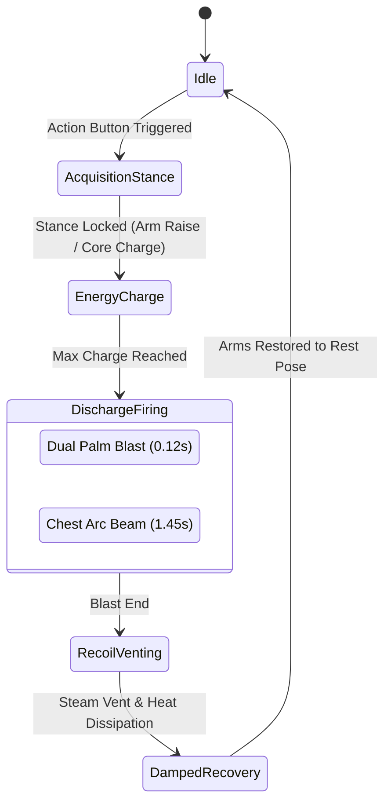

# AR Virtual Button &middot; BoxBot Interactive AR Experience

[-blue.svg?logo=unity)](https://unity.com/)
[](https://unity.com/srp/Universal-Render-Pipeline)
[](https://developer.vuforia.com/)
[](https://git-lfs.github.com/)
[](LICENSE)

An interactive, tabletop Augmented Reality (AR) experience built in **Unity 6** with the **Universal Render Pipeline (URP)** and **Vuforia Engine**. 

Instead of relying on standard touchscreen UI or rigid pre-baked zones, **AR Virtual Button** features a real-time **optical finger touch occlusion detection engine** directly analyzing camera frames. Placing a physical finger over virtual button targets printed on a card triggers dynamic interactions on a fully articulated, micro-mechanical robotic companion (**BoxBot / Mini Iron Man**).

---

## Highlights & Features

### 1. Real-Time Optical Finger Occlusion Engine
* **Physical Finger Touch on Paper**: Directly reads camera sensor frames (`PixelFormat.GRAYSCALE`) to measure directional luminance drop when a physical finger touches or casts a shadow over a virtual button.
* **Ambient Lighting & Flicker Invariance**: Compensates for global auto-exposure changes and lighting fluctuations by evaluating localized relative delta luminance rather than fixed absolute thresholds.
* **Top-Down Screen-to-Camera UV Transformation**: Accounts for camera sensor orientation and viewport scaling (including inverted Y transformations) to align 3D world-space button caps with camera-space pixel sampling coordinates.
* **Temporal Multi-Frame Debounce**: Requires consistent consecutive-frame occlusion confirmations to prevent false triggers from motion blur or swift hand transitions.
* **Touchscreen & Mouse Fallback**: Supports direct tap and click raycasting for testing in the Unity Editor or non-touch environments.

### 2. Interactive Virtual Buttons
| Button | Type | Action & Behavior |
| :--- | :--- | :--- |
| **Mood Button** | Physical Occlusion / Tap | Cycles through 5 distinct robot emotional states with dynamic PBR emissive materials, altering eye visor HUD, reactor core glow, and repulsor accents (Cyan, Gold, Red, Green, Blue). |
| **Action Button** | Physical Occlusion / Tap | Drives a deterministic 5-phase combat sequence, alternating between **Dual Palm Repulsor Pulse** and **Chest Arc Reactor Unibeam Laser**. |
| **Sound Button** | Physical Occlusion / Tap | Triggers spatialized robotic audio feedback (chirps, servo whirs, reactor telemetry) anchored to tabletop 3D space. |

### 3. BoxBot Character & Micro-Mechanics
* **378 Suit Micro-Primitives**: Procedurally assembled mechanical structure featuring cervical collars, brow cowl gaskets, banjos, femoral pivots, deltoid sensor rings, knuckle studs, and copper magnetic coils.
* **2nd-Order Spring Dynamics & Kinematics**: Implements unconditionally stable second-order dynamic equations ($\ddot{y} + 2\zeta\omega\dot{y} + \omega^2 y = \omega^2 x + 2\zeta\omega r\dot{x}$) with dynamic pole clamping (based on Keijiro / Freya Holmér formulations) for natural mechanical inertia, recoil, and damping.
* **Exact Ground Invariance**: Strictly enforces a $Y = 0.0000\text{m}$ ground contact boundary to guarantee feet never clip through the physical tracking target during recoil or dynamic poses.

### 4. Custom URP Shaders & VFX Suite
* **Custom HLSL Shaders**:
  * `LaserEnergyBeam.shader`: Dual-layer volumetric laser beam with core and outer mantle fresnel falloff.
  * `EnergyRingCollimator.shader`: Concentric expanding electromagnetic collimator rings.
  * `GroundHeatGlow.shader`: Additive planar heat glow projection with dynamic thermal dissipation.
* **SRP Batcher Optimized**: Dynamic shared material handling ensures high-performance rendering on mobile devices with zero runtime material leaks.
* **Zero-Collider Policy**: VFX entities do not instantiate physics colliders, guaranteeing zero interference with optical touch raycasting.

### 5. Zero-Dependency Procedural Audio Synthesizer
* **Runtime Procedural Waveform Synthesis**: Generates sci-fi audio in memory via `AudioClip.Create` without external audio assets:
  * Servo motor glides
  * Harmonic energy charge whines
  * High-impact repulsor blasts
  * Resonant unibeam continuous beam discharge
  * Steam pressure relief venting
* **Spatialized Multi-Node Audio**: Sound origins are localized between the chest reactor core and arm wrist emitters for realistic 3D acoustic perspective.

### 6. Diagnostic HUD & Telemetry Overlay
* Built-in `OnGUI` telemetry suite providing:
  * Live camera swatch pixel previews under each virtual button cap.
  * Real-time luminance, baseline, and delta drop readouts.
  * Screen-space bounding reticles mapped directly to physical target locations.
  * Interactive on-screen controls for threshold sensitivity tuning (`More Sensitive` / `Less Sensitive`), baseline recalibration, and combat mode cycling.

---

## Action State Machine

The Action Button operates on a deterministic 5-Phase Hierarchical Finite State Machine:



---

## Project Structure

```text
AR Virtual Button/
├── Assets/
│   ├── BoxBot/
│   │   ├── Materials/       # PBR materials (Red, Gold, Silver, Dark Metal, Emissives)
│   │   ├── Scripts/
│   │   │   ├── BoxBotController.cs          # Optical touch engine, Vuforia frame reader, HUD
│   │   │   ├── BoxBotActionSequencer.cs     # 5-Phase Finite State Machine
│   │   │   ├── BoxBotProceduralMotion.cs    # 2nd-order spring physics & kinematics
│   │   │   ├── BoxBotVFXController.cs       # Laser beams, collimators, heat glow
│   │   │   └── BoxBotAudioSynthesizer.cs    # In-memory procedural sound generation
│   │   ├── Shaders/         # Custom URP HLSL shaders (Laser, Collimator, Ground Heat)
│   │   └── Sounds/          # Tabletop spatial audio clips
│   ├── Editor/
│   │   ├── ActionUpgradeSelfVerification.cs    # Automated shader & system test suite
│   │   ├── MiniIronManWholeBodyAudit.cs        # Hierarchy & primitive integrity audit
│   │   └── WholeBodyMicroMechanicsAssembler.cs # Procedural 378-primitive suit generator
│   ├── Resources/           # Vuforia configuration assets
│   ├── Scenes/
│   │   └── SampleScene.unity # Main AR tabletop scene
│   ├── Settings/            # URP Graphics & Volume Profiles
│   └── postcard.png         # Printable image target marker
├── Packages/
│   ├── com.ptc.vuforia.engine-11.4.4.tgz  # Vuforia package tarball (tracked via Git LFS)
│   ├── manifest.json
│   └── packages-lock.json
├── ProjectSettings/         # Unity engine and project configuration
├── .gitattributes           # Git LFS rules & Unity YAML merge drivers
└── .gitignore               # Comprehensive Unity ignore rules
```

---

## Getting Started

### Prerequisites
* **Unity 6** (`6000.1.6f1` or later) with Android / iOS Build Support if deploying to mobile.
* **Git** and **[Git LFS](https://git-lfs.github.com/)** installed on your system.
* A standard webcam (for Unity Editor testing) or a supported AR mobile device.

### 1. Clone the Repository
Because the Vuforia engine package (`com.ptc.vuforia.engine-11.4.4.tgz`) is stored via Git LFS, clone with LFS enabled:

```bash
# Clone the repository
git clone https://github.com/Jmmmmjm/ar-virtual-button.git

# Enter project directory
cd ar-virtual-button

# Ensure LFS files are pulled
git lfs pull
```

### 2. Print or Display the Target Marker
* Open `Assets/postcard.png`.
* Print the image on paper or display it on a tablet or second monitor placed flat on a table.

### 3. Open in Unity
1. Launch **Unity Hub**.
2. Click **Add** -> **Add project from disk**.
3. Select the `AR Virtual Button` folder.
4. Ensure the Editor version is set to **Unity 6 (6000.1.6f1)** or compatible.
5. Open the project.

### 4. Running the Experience
1. In the Project window, open `Assets/Scenes/SampleScene.unity`.
2. Ensure your webcam is connected (configured under **Window** -> **Vuforia Configuration** -> **Camera Device**).
3. Press **Play** in Unity.
4. Point the webcam at the printed or displayed `postcard.png` marker.
5. Touch the button areas on the paper with your physical finger, or click them directly with your mouse in the Game view!

---

## Editor Tools & Verification

The project includes custom editor utilities accessible from the Unity top menu bar under **MiniIronMan**:
* **MiniIronMan -> Run Action Mode Self-Verification**: Executes an automated audit validating all custom URP HLSL shaders, materials, line renderers, dynamic shared materials, and component linkages.
* **MiniIronMan -> Assemble Whole Body Micro Mechanics**: Rebuilds or refreshes the 378 suit micro-primitives.

---

## Technical Specifications

| Parameter | Specification |
| :--- | :--- |
| **Engine Version** | Unity 6000.1.6f1 |
| **Render Pipeline** | Universal Render Pipeline (URP 17.1.0) |
| **AR Framework** | PTC Vuforia Engine 11.4.4 |
| **Input System** | Unity New Input System + Vuforia Frame Camera Stream |
| **Physics / Kinematics** | Custom 2nd-Order Spring Dynamics (Zero Allocations) |
| **Target Size** | Width: 0.14m, Height: 0.099m (Postcard Aspect Ratio) |

---

## License

This project is open-source and available under the [MIT License](LICENSE).
