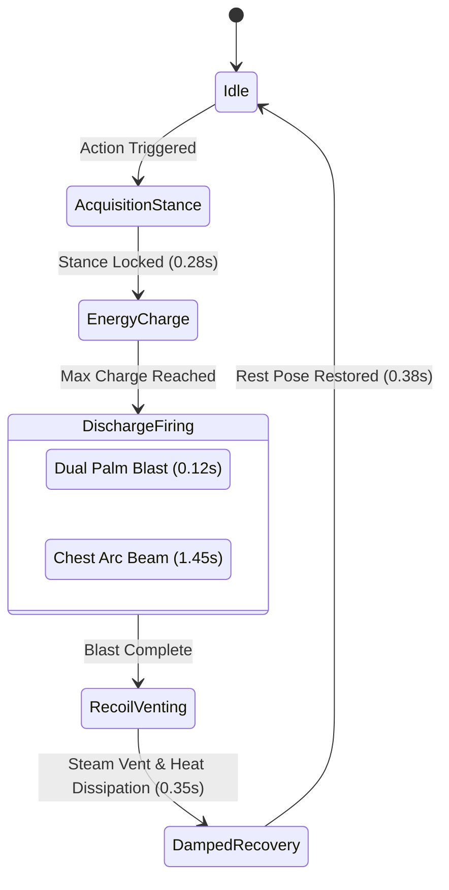

# AR Virtual Button &middot; BoxBot Interactive AR Experience

[-blue.svg?logo=unity)](https://unity.com/)
[](https://unity.com/srp/Universal-Render-Pipeline)
[](https://developer.vuforia.com/)
[](https://git-lfs.github.com/)
[](LICENSE)

An interactive, tabletop Augmented Reality (AR) experience built in **Unity 6** using the **Universal Render Pipeline (URP)** and **PTC Vuforia Engine**.

Instead of relying on standard touchscreen UI or rigid pre-baked zones, **AR Virtual Button** features a custom real-time **optical finger touch occlusion engine** directly sampling the camera sensor feed. Placing a physical finger over virtual button targets on a printed card triggers dynamic interactions on a micro-mechanical robotic companion (**BoxBot / Mini Iron Man**).

---

## Highlights & Technical Architecture

### 1. Real-Time Optical Finger Occlusion Touch Engine
* **Camera Sensor Frame Sampling**: Directly samples device camera frames (`PixelFormat.GRAYSCALE`) at runtime via Vuforia's camera device stream.
* **$15 \times 15$ Pixel Sampling Kernel**: Computes local luminance over a stride-aware $(2 \times \text{radius} + 1)$ kernel ($\text{radius} = 7$) centered on each virtual button coordinate, eliminating single-pixel noise.
* **Screen-to-Camera UV Transformation**: Transforms 3D world-space button positions to screen coordinates and maps them into camera image space with inverted Y compensation (`topDownY = Screen.height - outScreenPos.y`), with automatic fallback to viewport coordinates.
* **Directional Luminance Delta & Adaptive Baseline**: Detects physical finger coverage via drop from baseline ($\Delta\text{drop} = \text{baseline} - \text{currentLum}$). When unoccluded and $\Delta\text{drop} < 10$, the baseline dynamically tracks ambient light drift via an exponential moving average (`Mathf.Lerp(baseline, currentLum, 0.03f)`).
* **Multi-Frame Debounce & Hysteresis**: Requires $2$ consecutive frames exceeding `occlusionThreshold` (default: $25\text{--}28$) before registering a press. Release is governed by a $40\%$ hysteresis threshold (`drop < occlusionThreshold * 0.4f`) to prevent button chatter.
* **Physical & Visual Button Response**: Button caps depress by $1.0\text{mm}$ ($-0.001\text{m}$ along $Y$) for $0.15\text{s}$ while indicator materials flash with emissive highlight for $0.18\text{s}$.
* **Touchscreen & Mouse Fallback**: Supports direct tap and left-click raycasting in the Unity Game view for rapid editor iteration without camera interaction.

---

### 2. Interactive Virtual Buttons

| Button | Input Mode | Action & Visual / Audio Feedback |
| :--- | :--- | :--- |
| **Mood Button** | Optical Occlusion / Tap | Cycles through 5 robot emotional profiles: **Cyan &rarr; Red &rarr; Gold &rarr; Green &rarr; Blue** (`Mat_EmissiveCyan`, `Mat_EmissiveRed`, `Mat_EmissiveGold`, `Mat_EmissiveGreen`, `Mat_EmissiveBlue`). Dynamically drives visor HUD, arc reactor core, and suit trim. |
| **Action Button** | Optical Occlusion / Tap | Triggers a deterministic 5-phase combat sequence, automatically alternating between **Dual Palm Repulsor Pulse** and **Chest Arc Reactor Unibeam Laser**. |
| **Sound Button** | Optical Occlusion / Tap | Plays tabletop spatialized robot sound effects (`reactor_beep.wav`, `robot_chirp.wav`, `servo_whir.wav`) with randomized pitch modulation ($0.90\text{--}1.15\times$). |

---

### 3. BoxBot Character & Micro-Mechanics
* **378 Suit Micro-Primitives**: Procedurally assembled hierarchical robot anatomy including cervical collars, brow cowl gaskets, banjos, femoral pivots, deltoid sensor rings, knuckle studs, repulsor iris blades, and copper induction coils.
* **2nd-Order Spring Dynamics System**: Formulated on Keijiro / Freya Holmér continuous second-order differential equations:
  $$\ddot{y} + 2\zeta\omega\dot{y} + \omega^2 y = \omega^2 x + 2\zeta\omega r\dot{x}$$
  Implements Symplectic (Semi-Implicit) Euler integration with dynamic pole clamping (`k2Stable = Mathf.Max(k2, 0.5f * dt * dt + 0.5f * dt * k1, dt * k1)`) for unconditional stability at any mobile AR frame rate.
* **Exact Ground Invariance ($Y = 0.0000\text{m}$)**: Polycentric knee flexion ($11.5^\circ\text{--}14.0^\circ$) and Achilles rod compression ($-0.92\text{mm}$) dynamically compensate for pelvic crouch ($-1.25\text{mm}$ to $-1.65\text{mm}$), ensuring boot soles never penetrate the tracking card.
* **Mechanical Armor Jitter & Resonance**: Multi-harmonic inharmonic vibration synthesizer simulating structural armor resonance using golden-ratio harmonics ($34\text{Hz}$, $55\text{Hz}$, $89\text{Hz}$) with a pre-fire vacuum tension dip at $0.94$ progress.

---

### 4. Custom URP Shaders & VFX Suite
* **`LaserEnergyBeam.shader`**: Dual-layer volumetric laser line renderer with intense core and outer mantle fresnel falloff.
* **`EnergyRingCollimator.shader`**: Triple concentric expanding electromagnetic collimator rings positioned along the chest firing axis.
* **`GroundHeatGlow.shader`**: Additive planar heat glow projection under the character with progressive thermal dissipation.
* **SRP Batcher Optimized**: Dynamic shared material management mutates emissive overdrive properties without instantiating material leaks.
* **Zero-Collider Policy**: VFX entities do not carry physics colliders, guaranteeing zero interference with optical touch raycasts.

---

### 5. Zero-Dependency Procedural Audio Synthesizer
Synthesizes sci-fi audio waveforms directly in memory at runtime via `AudioClip.Create` (44.1 kHz, mono):
* **Servo Glide (0.55s)**: High-torque mechanical servo glide with harmonic sawtooth and sub-oscillator envelope ($220\text{Hz}\text{--}540\text{Hz}$).
* **Capacitor Whine (0.85s)**: Exponential turbine rise ($350\text{Hz}\text{--}2800\text{Hz}$) + sub-bass rumble ($38\text{Hz}\text{--}65\text{Hz}$) + $120\text{Hz}$ rectified electrical hum with pre-fire vacuum cutoff.
* **Repulsor Blast (0.45s)**: Supersonic transient crack ($0.5\text{ms}$ attack) with steep exponential pitch dive ($1200\text{Hz}\rightarrow 85\text{Hz}$).
* **Unibeam Sustain (1.80s)**: Continuous resonant dual-oscillator plasma discharge with stereo panning jitter.
* **Steam Pressure Vent (0.65s)**: Exponential band-limited white noise pressure relief decay.
* **Tabletop AR Spatialization**: Multi-node audio playback configured on chest core and arm pivots with logarithmic rolloff ($0.06\text{m}$ min, $2.5\text{m}$ max) and clamped Doppler ($0.15$) to eliminate handheld wobble artifacts.

---

### 6. Diagnostic HUD & Telemetry Overlay
* Built-in `OnGUI` telemetry suite providing:
  * Live camera swatch pixel previews directly under each virtual button cap.
  * Real-time luminance, baseline, and delta drop readouts.
  * Screen-space bounding reticles mapped directly to physical target locations (`M` = Mood, `A` = Action, `S` = Sound).
  * Interactive on-screen controls for threshold sensitivity tuning (`More Sensitive` / `Less Sensitive`), baseline recalibration (`Reset Baselines`), and combat mode cycling (`Cycle Attack`).

---

## Action State Machine

The Action Button drives a deterministic 5-Phase Hierarchical Finite State Machine:



### Combat Pose Specifications
* **Repulsor Pulse**:
  * Shoulder elevation to $-85^\circ$ with $+12^\circ$ blast recoil kick.
  * Elbow tension flexion ($35^\circ$) snapping to $6.5^\circ$ micro-bend on blast with $+18^\circ$ recoil kick.
  * Wrist hyperextension cocking to $-85^\circ$ pointing palms forward with $+15^\circ$ recoil kick.
  * Repulsor iris blade mechanical dilation ($+0.85\text{mm}$, $+12.5^\circ$ rotation), snapping to $-0.30\text{mm}$ collimation on blast.
* **Unibeam Laser**:
  * Bilateral Flank Power Brace: Shoulder retraction ($+24^\circ$), abduction ($+10.5^\circ$), convergence ($-3.5^\circ$ left / $+3.5^\circ$ right).
  * Anterior elbow flexion ($-96.5^\circ$ strictly forward along $+Z$).
  * Wrist semi-pronated hammer power grip ($-25^\circ$ pitch, $-60^\circ$ roll, $\pm 6^\circ$ yaw).
  * Distal fist clench ($+20^\circ$) and iris aperture shielding ($-0.55\text{mm}$).
  * Torso forward surge ($+3.5\text{mm}$), sustained shudder, and dorsal air-brakes deployment ($+18^\circ$ firing, $+26^\circ$ cooling).

---

## Project Structure

```text
AR Virtual Button/
├── Assets/
│   ├── BoxBot/
│   │   ├── Materials/       # PBR & emissive materials (Cyan, Red, Gold, Green, Blue, Metals)
│   │   ├── Scripts/
│   │   │   ├── BoxBotController.cs          # Optical touch engine, Vuforia frame reader, HUD
│   │   │   ├── BoxBotActionSequencer.cs     # 5-Phase Finite State Machine
│   │   │   ├── BoxBotProceduralMotion.cs    # 2nd-order spring physics & kinematics
│   │   │   ├── BoxBotVFXController.cs       # Laser beams, collimators, heat glow
│   │   │   └── BoxBotAudioSynthesizer.cs    # In-memory procedural sound generation
│   │   ├── Shaders/         # Custom URP HLSL shaders (Laser, Collimator, Ground Heat)
│   │   └── Sounds/          # Spatial audio clips (reactor_beep, robot_chirp, servo_whir)
│   ├── Editor/
│   │   ├── ActionUpgradeSelfVerification.cs    # Automated shader & system test suite
│   │   ├── MiniIronManLegAnalyzer.cs           # Leg kinematics & bone vector analyzer
│   │   ├── MiniIronManWholeBodyAudit.cs        # Whole-body spatial & ground contact audit
│   │   └── WholeBodyMicroMechanicsAssembler.cs # Procedural 378-primitive suit generator
│   ├── Resources/
│   │   └── VuforiaConfiguration.asset          # Vuforia license & device settings
│   ├── Scenes/
│   │   └── SampleScene.unity                   # Main AR tabletop scene
│   ├── Settings/                               # URP Graphics & Volume Profiles
│   └── postcard.png                            # Printable image target marker
├── Packages/
│   ├── com.ptc.vuforia.engine-11.4.4.tgz       # Vuforia package tarball (tracked via Git LFS)
│   ├── manifest.json
│   └── packages-lock.json
├── ProjectSettings/                            # Unity engine configuration
├── .gitattributes                              # Git LFS rules & Unity YAML merge drivers
└── .gitignore                                  # Comprehensive Unity ignore rules
```

---

## Getting Started

### Prerequisites
* **Unity 6** (`6000.1.6f1` or compatible) with Android / iOS Build Support if deploying to mobile.
* **Git** and **[Git LFS](https://git-lfs.github.com/)** installed on your system.
* A standard webcam (for Unity Editor testing) or a supported AR mobile device.

### 1. Clone the Repository
Because the Vuforia engine package (`com.ptc.vuforia.engine-11.4.4.tgz`) is stored via Git LFS, clone with LFS enabled:

```bash
# Clone the repository
git clone https://github.com/Jmmmmjm/ar-virtual-button.git

# Enter project directory
cd ar-virtual-button

# Ensure LFS files are pulled
git lfs pull
```

### 2. Print or Display the Target Marker
* Open `Assets/postcard.png`.
* Print the image on paper or display it on a tablet/monitor placed flat on a table (Target dimensions: $0.14\text{m} \times 0.0993\text{m}$, postcard aspect ratio).

### 3. Open in Unity
1. Launch **Unity Hub**.
2. Click **Add** &rarr; **Add project from disk**.
3. Select the `AR Virtual Button` folder.
4. Ensure the Editor version is set to **Unity 6 (6000.1.6f1)** or compatible.
5. Open the project.

### 4. Running the Experience
1. In the Project window, open `Assets/Scenes/SampleScene.unity`.
2. Ensure your webcam is connected (configured under **Window** &rarr; **Vuforia Configuration** &rarr; **Camera Device**).
3. Press **Play** in Unity.
4. Point the webcam at the printed or displayed `postcard.png` marker.
5. Touch the button areas on the paper with your physical finger, or click them directly with your mouse in the Game view!

---

## Editor Tools & Verification

The project includes custom editor utilities accessible from the Unity top menu bar:

### `MiniIronMan` Menu
* **MiniIronMan &rarr; Run Action Mode Self-Verification**: Executes an automated audit validating all custom URP HLSL shaders, materials, line renderers, dynamic shared materials, and component linkages.
* **MiniIronMan &rarr; Assemble Whole Body Micro Mechanics**: Rebuilds or refreshes the 378 suit micro-primitives.
* **MiniIronMan &rarr; Reorganize Arm Sub-Joints Now**: Re-parents elbow, wrist, and iris blade sub-joint hierarchies.
* **MiniIronMan &rarr; Wire Action Mode Subsystems**: Resolves and wires sequencer, procedural motion, VFX controller, and audio synthesizer references.

### `Tools` Menu
* **Tools &rarr; Run Whole-Body Mini Iron Man Audit**: Executes comprehensive whole-body micro-mechanical spatial validation and verifies $Y = 0.0000\text{m}$ ground plane contact adherence.
* **Tools &rarr; Analyze Mini Iron Man Legs**: Audits leg kinematics, thigh-to-shin bone vectors, and knee joint limits.

---

## Technical Specifications

| Parameter | Specification |
| :--- | :--- |
| **Engine Version** | Unity 6000.1.6f1 |
| **Render Pipeline** | Universal Render Pipeline (URP 17.1.0) |
| **AR Framework** | PTC Vuforia Engine 11.4.4 |
| **Input System** | Unity New Input System + Vuforia Frame Camera Stream |
| **Physics / Kinematics** | Custom 2nd-Order Spring Dynamics (Zero Allocations) |
| **Target Size** | Width: 0.14m, Height: 0.0993m (Postcard Aspect Ratio: 0.7094) |
| **Sampling Kernel** | $15 \times 15$ pixel local grayscale luminance kernel (radius = 7) |
| **Debounce Filter** | 2 consecutive frames drop confirmation + 40% hysteresis release |

---

## License

This project is open-source and available under the [MIT License](LICENSE).
